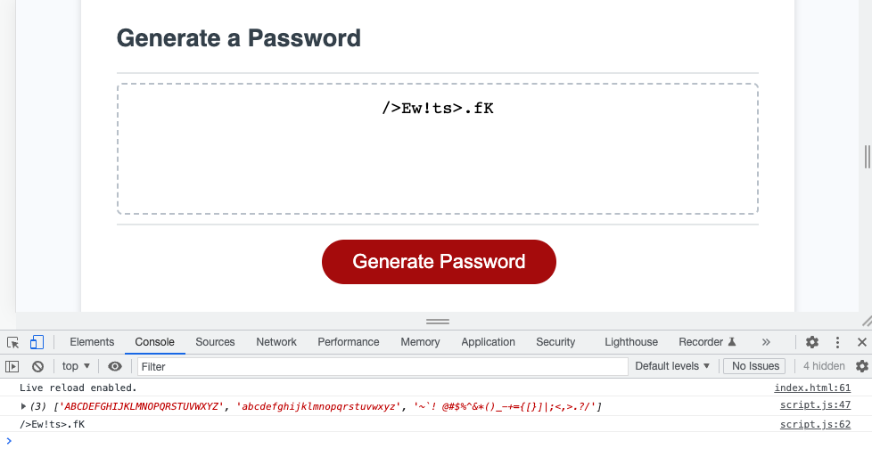

# Challenge Three - JavaScript Password Generator

## Description
This week's assignment was to create a random password generator where users get prompts to pick the length, and the types of characters used in it. The assignment was completely in JavaScript, and we had to build the application from a small amount of starter code.

Unlike CSS and HTML, in JavaScript you really have to think like a computer would, and break down every single aspect of what you want your application to do. Creating a random password generator helps students like me get their feet wet into just how much you have to break it down -- it's not too complex, but complex enough that it includes many aspects of JavaScript such as variables, functions, and loops.

This project took me from thinking I had the jist of JavaScript down, to realizing just how much practice I need. Reverse engineering JavaScript is relatively easy for me, but doing it the other direction and writing it myself is still quite a challenge for me. Many parts of my final project are things that we didn't actually learn during class hours. One of which is a while loop, which makes the function repeat itself until correct criteria (in this case a value between 8 and 128) is entered. Additionally, using the .push method to get the users' selected criteria into an array for the randomizing function to choose from was something my tutor showed me, as well as Jonathan in office hours.

In the above screenshot, you can see that the array displayed in the console, as well as the generated password, doesn't have numbers in it (despite there being a numbers string in the .js file). This is because when prompted, the user selected no on their password containing numbers, so numbers weren't included in the userAnswers array variable.

## Link
You can check out my application at https://carlihudson.github.io/javascript-password-generator-carli

## Usage
This application can be used to help users with sensitive data to generate a completely random password nearly impossible for anyone to figure out. 

## Credits
This week, I worked with two of my classmates, Ken Gibson and Juan Sanchez. The three of us had many conversations and even a Friday night zoom session to walk through what was needed step by step. Additionally, I had help from my tutor, Corrado Alfano, and instructor, Jonathan Harvey.

